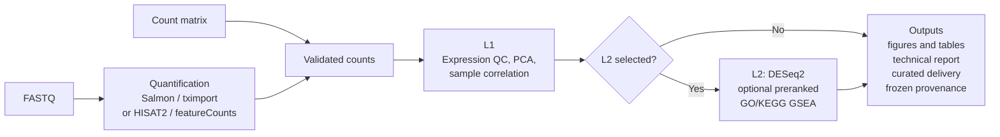

English | [繁體中文](README_zh-TW.md)

# nf-rna

`nf-rna` is a reproducible bulk RNA-seq workflow for FASTQ and raw-count projects. It validates declared inputs and design, performs the selected QC and analysis stages, and produces figures, tables, a technical report, and frozen provenance.

`rnaseq` is the control plane, Nextflow is the execution plane, and Docker is the process runtime. Production users enter through `rnaseq`; they do not build an execution image or invoke internal Nextflow modules.

## Features

- FASTQ projects using nf-core/rnaseq with Salmon/tximport or first-party HISAT2 + featureCounts.
- Raw-count projects with validated metadata, explicit contrasts, QC, differential expression, and optional preranked GSEA.
- Immutable runs with frozen configuration, execution-image identity, workflow hashes, and curated delivery artifacts.

## Architecture

nf-rna provides one validated, count-based downstream workflow for two input routes. FASTQ projects first perform upstream quantification; count-matrix projects enter the downstream path after their supplied counts are validated. Both routes converge on the same expression analysis.



L1 provides expression quality control and exploration. L2 is explicitly selected: it performs DESeq2 for declared contrasts and may be followed by supported preranked GO/KEGG GSEA; it is never inferred from metadata or contrasts. Each route produces figures, tables, a technical report, curated delivery artifacts, and frozen provenance.

## Inputs and outputs

### Inputs

- **FASTQ:** place reads in `input/fastq/`. FASTQ projects quantify with the selected Salmon/tximport or HISAT2 + featureCounts route and require an execution-ready reference compatible with that route.
- **Count matrix:** place an imported gene-count matrix in `input/counts.csv` when quantification was completed elsewhere and nf-rna should perform the validated downstream analysis.
- **Design files:** `metadata.csv` provides sample IDs and design variables; `contrasts.csv` declares the directional contrasts used by L2.
- **References:** FASTQ projects declare the selected reference route explicitly. Reference identity and checksums are validated and frozen with the run rather than inferred from local files.

### Outputs

Every authorized execution creates an immutable run under `runs/<case-id>/<run-id>/`. The run keeps frozen inputs and configuration, execution-image and workflow identity, and provenance alongside its analysis artifacts.

- **Upstream count data:** FASTQ projects retain upstream QC and the Salmon/tximport or featureCounts count handoff; count-matrix projects retain their validated imported count source.
- **L1 QC:** filtering and normalization records, transformed expression for visualization, PCA, sample correlation, and QC tables and figures.
- **L2 results:** when selected, DESeq2 results for each declared contrast, with associated tables and figures.
- **Enrichment:** when enabled for L2, preranked GO (BP, MF, CC) and KEGG GSEA results; over-representation analysis is not part of this production path.
- **Delivery:** a technical HTML report and a curated delivery package of figures, tables, methods/version records, provenance, and a delivery manifest.

## Requirements

Use a supported Linux or WSL workstation with:

- Python 3.11+ with `venv` and Git;
- Docker with a running daemon;
- Bash, Java 17+, and Nextflow on `PATH`; and
- sufficient local storage for references and Nextflow work data.

Java and Nextflow run on the host. R, DESeq2, HISAT2, featureCounts, SAMtools, and Salmon are provided by execution images; normal users do not install them on the host. See the [Nextflow installation guide](https://docs.seqera.io/nextflow/install).

## Installation

nf-rna has no PyPI distribution. Install a released CLI from its Git tag and pull the matching official image. Replace `X.Y.Z` with the released version you intend to use:

```bash
RELEASE_VERSION=X.Y.Z
python3.11 -m venv ~/.venvs/nf-rna-${RELEASE_VERSION}
source ~/.venvs/nf-rna-${RELEASE_VERSION}/bin/activate
python -m pip install --upgrade pip
python -m pip install "git+https://github.com/2002brian/nf-rna.git@v${RELEASE_VERSION}"
docker pull ghcr.io/2002brian/nf-rna:${RELEASE_VERSION}
rnaseq --version
rnaseq doctor
```

The release contract is deliberate:

```text
CLI X.Y.Z  ↔  Git tag vX.Y.Z  ↔  ghcr.io/2002brian/nf-rna:X.Y.Z
```

`rnaseq doctor` is read-only: it verifies the host environment and locally available image but does not pull or build images.

## Quick Start

```bash
mkdir -p ~/projects/rnaseq-projects
cd ~/projects/rnaseq-projects
rnaseq new
cd <new-project>
# Add FASTQs to input/fastq/, or a count matrix to input/counts.csv.
# Complete metadata.csv and contrasts.csv.
rnaseq validate .
rnaseq plan .
rnaseq doctor .
rnaseq run . --case-id CASE-001 --profile local --yes
```

The wizard creates a project scaffold; it does not infer scientific inputs. FASTQ projects also need an execution-ready reference. Register an existing checksum-bound managed reference with `rnaseq reference register /absolute/reference-root`, or configure a supported reference route. See the [detailed Quick Start](docs/quickstart.md).

## Reproducibility

New projects use the execution image that matches the installed CLI version. A prerelease CLI likewise uses its explicit matching prerelease tag; publish and qualify that image before using the prerelease.

For formal analyses, use an explicit release tag or an immutable digest. `ghcr.io/2002brian/nf-rna:latest` is a convenience tag only and should not be used for an active production analysis. `rnaseq doctor PROJECT` reports requested and Docker-observed image identity.

## Documentation

- [Detailed Quick Start and v1.0.0 compatibility](docs/quickstart.md)
- [Runtime and reproducibility contract](docs/runtime.md)
- [Scientific contract](docs/scientific_contract.md)
- [Architecture](docs/architecture.md)

## Development

Cloning the source, editable installation, local image builds, and tests are contributor activities. See [Development installation](docs/development.md).
