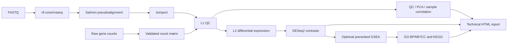

English | [繁體中文](README_zh-TW.md)

# nf-rna

`nf-rna` is a reproducible bulk RNA-seq analysis workflow for researchers who start with either FASTQ files or raw gene-count matrices. It turns validated project inputs into quality-control results, differential-expression and optional GSEA results, figures, tables, a technical report, and the provenance needed to understand how those results were produced.

For FASTQ projects, nf-rna combines pinned nf-core/rnaseq 3.26.0, Salmon, and tximport with first-party DESeq2 and clusterProfiler analysis. Scientific and execution settings are explicit rather than inferred, so the same declared project can be reviewed and rerun with a clear record of its inputs and choices.

The public project is `nf-rna` (`v0.4.3`). Its stable CLI and Python namespace are both `rnaseq`; the validated production Docker image remains `rnaseq-control-plane:latest` for compatibility with existing immutable run provenance.

## Overview

Bulk RNA-seq projects often arrive through two very different routes: raw reads that still need quantification, or a gene-count matrix supplied by another workflow. nf-rna gives both routes one validated downstream analysis path.

```text
FASTQ or raw counts
        ↓
validated project configuration
        ↓
RNA-seq analysis
        ↓
QC / DESeq2 / optional GSEA
        ↓
figures / tables / technical report / provenance
```

The result is a technical analysis package that is easier to inspect, reproduce, and hand off than an ad-hoc collection of scripts and output files.

## Workflow



L1 is the quality-control and exploratory-expression layer. L2 is selected explicitly and adds differential expression; GSEA is optional within L2. An L1 project does not run DESeq2 contrast testing or GSEA merely because contrast metadata is present.

## What nf-rna does

| Stage | Analysis | Main outputs |
| --- | --- | --- |
| FASTQ route | nf-core/rnaseq 3.26.0 with Salmon pseudoalignment | Standardized Salmon/tximport handoff and upstream QC artifacts |
| L1 | Filtering, normalization, blind VST, PCA, and sample correlation | QC tables, normalized counts, VST matrix, PCA and correlation figures |
| L2 | DESeq2 for configured contrasts | Differential-expression tables, volcano plots, and DEG heatmaps when applicable |
| GSEA | Preranked GO and KEGG GSEA | GO BP/MF/CC and KEGG term tables and dotplots when enabled |
| Reporting and delivery | Technical reporting, frozen configuration, and curated artifacts | HTML report, PNG and 300-dpi TIFF figures, tables, methods/version records, and provenance |

## Input routes

### FASTQ

```text
FASTQ → nf-core/rnaseq → Salmon → tximport → nf-rna downstream analysis
```

FASTQ projects support paired-end and single-end reads. They explicitly declare whether reads are `raw` or `pretrimmed`; nf-rna never infers that decision from a file name, directory name, or read content. A reference strategy must also be declared explicitly, including the selected local reference or supported iGenomes route.

Use this route when nf-rna should own read processing as well as downstream analysis.

### Raw counts

```text
gene-count matrix + metadata + contrasts → nf-rna → L1/L2
```

The raw-count route accepts a non-negative integral count matrix with `gene_id`, extensible metadata, and explicit directional contrasts. It is useful when quantification was performed elsewhere and you need validated QC, DESeq2, optional GSEA, reporting, and provenance without rerunning read processing.

See the [quick start](docs/quickstart.md) and [scientific contract](docs/scientific_contract.md) for the complete configuration rules.

## Quick start

### 1. Install

```bash
git clone https://github.com/2002brian/nf-rna.git
cd nf-rna
conda env create -f environment.yml
conda activate nf-rna
docker build -t rnaseq-control-plane:latest .
```

Python 3.11+ is required. Install Nextflow before using the FASTQ route, and ensure Docker Desktop or another compatible Docker daemon is running.

### 2. Check the runtime

```bash
rnaseq doctor
```

`rnaseq doctor` reports non-mutating prerequisite checks for the local runtime; with a project path it also evaluates project and reference readiness.

### 3. Try the included smoke test

```bash
rnaseq validate examples/nfcore_smoke_test
rnaseq plan examples/nfcore_smoke_test
rnaseq run examples/nfcore_smoke_test --case-id SMOKE-001 --profile local --yes
```

- `validate` verifies the project inputs and configuration without running analysis.
- `plan` previews and records the intended analysis after validation.
- `run` performs a real immutable analysis run. It can pull containers, process the public fixture, and use local compute and storage.

The bundled smoke fixture is an integration check, not a biological study and not a basis for biological interpretation.

### 4. Start your own project

```bash
rnaseq new
```

The interactive command creates `project.yaml`, `metadata.csv`, `contrasts.csv`, `input/`, and `planning/`. Populate `input/` with either your FASTQs or count matrix; complete metadata with `sample_id` and every design-formula variable; and provide directional contrasts for L2 differential-expression work.

## What you get

Every authorized execution creates a new run beneath `runs/<case-id>/<run-id>/`. The curated client-facing content is assembled into `delivery/`; operational caches and work directories remain outside the delivery package.

```text
runs/<case-id>/<run-id>/
├── delivery/
│   ├── figures/png/
│   ├── figures/tiff_300dpi/
│   ├── tables/
│   ├── methods_and_versions/
│   └── report_YYYYMMDD.html
├── downstream/
│   ├── l1/
│   ├── l2/                         # L2 projects only
│   └── report/report.html
└── provenance/
```

Depending on the selected route and analysis level, the package can include QC figures, PCA, sample-correlation results, normalized-count and expression summaries, differential-expression tables, volcano plots, DEG heatmaps, GO GSEA and KEGG GSEA results, a technical HTML report, and frozen configuration/provenance records. Figures are delivered as PNG and 300-dpi TIFF; no PDF or SVG delivery format is produced.

## Scientific defaults

| Component | Default or contract |
| --- | --- |
| Differential expression | DESeq2 with the validated additive design and configured directional contrast |
| Effect direction | `log2FC > 0` means higher expression in the contrast numerator |
| Significance | `padj < thresholds.padj` and `abs(log2FoldChange) >= thresholds.abs_log2fc` (template values: `0.05` and `1.0`) |
| Multiple testing and LFC | DESeq2 native independent filtering and Benjamini–Hochberg adjustment; unshrunken log2 fold changes |
| GSEA ranking | All finite tested-gene DESeq2 Wald statistics, with no DEG, p-value, adjusted-p-value, or effect-size prefilter |
| GO GSEA | BP, MF, and CC using supported local organism annotation packages |
| KEGG GSEA | clusterProfiler through the declared online KEGG route |
| FASTQ quantification | Salmon pseudoalignment through pinned nf-core/rnaseq 3.26.0, then tximport |
| Raw-count input | DESeq2 `DESeqDataSetFromMatrix` from the validated count matrix and metadata |

See [docs/scientific_contract.md](docs/scientific_contract.md) for the complete scientific contract and its boundaries.

## Reproducibility and safety

nf-rna validates inputs before analysis and does not silently add metadata variables, reinterpret preprocessing, change references, or alter statistical settings. Planning records the intended analysis deterministically for unchanged inputs.

Each execution creates a new immutable run directory rather than overwriting an earlier analysis. The run stores its frozen configuration, selected reference strategy, runtime facts, and provenance, making it possible to trace which declared inputs and settings produced a result. The downstream R runtime is containerized, while bounded local resource profiles help avoid uncontrolled Docker oversubscription without changing the scientific calculation.

## Architecture

| Layer | Responsibility |
| --- | --- |
| Python control plane | Creates projects, validates contracts, plans work, freezes execution inputs, and assembles delivery artifacts |
| Nextflow and nf-core | Orchestrates FASTQ processing and the downstream workflow graph |
| R statistical backend | Runs L1 QC, DESeq2, GSEA, and plot generation from the frozen configuration |

Read the concise [architecture guide](docs/architecture.md) for lifecycle and data-flow details.

## Validation

At the public-packaging review, the non-expensive regression suite completed with **187 passed, 1 deselected**. The deselected test is an explicitly expensive L2 determinism test. A fresh L1 FASTQ smoke run also completed upstream nf-core/Salmon processing, immutable handoff staging, L1 analysis, L1-only reporting, and delivery assembly without invoking control-plane L2 or GSEA.

These are software and regression checks. They demonstrate that the implemented workflow paths behaved as expected for their fixtures; they do not establish biological validity for a new study or replace experimental-design review.

## Requirements and limitations

- Python 3.11+, Docker, and adequate local storage are required.
- Nextflow is required for the FASTQ route.
- Host/container architecture, image availability, and registry access remain runtime responsibilities.
- L2 inference requires appropriate biological replication; nf-rna does not make an unreplicated 1-vs-1 comparison suitable for DESeq2 inference.
- KEGG GSEA depends on the declared online KEGG route and may report network unavailability.
- nf-rna produces technical analysis artifacts only; it does not provide clinical decisions or biological interpretation.

## Documentation

| Document | Purpose |
| --- | --- |
| [Architecture](docs/architecture.md) | Lifecycle, data flow, immutable runs, and execution boundaries |
| [Scientific contract](docs/scientific_contract.md) | Input, DESeq2, GSEA, reference, and interpretation rules |
| [Runtime](docs/runtime.md) | Docker, Nextflow, local resource profiles, and filesystem expectations |
| [Quick start](docs/quickstart.md) | Detailed setup and project-configuration examples |
| [Workflow README](workflow/README.md) | Downstream Nextflow graph and resource-policy details |

## Citation and license

nf-rna `v0.4.3` is released under the [MIT License](LICENSE). Cite the specific release you use; the machine-readable record is [CITATION.cff](CITATION.cff).
