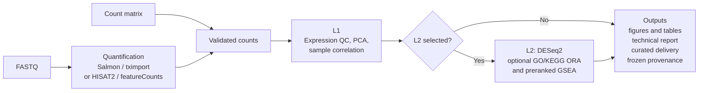

English | [繁體中文](README_zh-TW.md)

# nf-rna

`nf-rna` is a reproducible bulk RNA-seq workflow for FASTQ and raw-count projects. It validates declared inputs and design, performs the selected QC and analysis stages, and produces figures, tables, a technical report, and frozen provenance.

`rnaseq` is the control plane, Nextflow is the execution plane, and Conda provides every process environment. The supported runtime for v1.3.0 is **Linux x86-64 or Windows WSL2, with Nextflow and Conda**; Docker is not required. Production users enter through `rnaseq`; they do not invoke internal Nextflow modules.

## Features

- FASTQ projects using nf-core/rnaseq with Salmon/tximport or first-party HISAT2 + featureCounts.
- Raw-count projects with validated metadata, explicit contrasts, QC, differential expression, and optional GO/KEGG ORA and preranked GSEA.
- Immutable runs with frozen configuration, the exact nf-rna source commit, the locked Conda runtime identity, workflow hashes, and curated delivery artifacts.

## Architecture

nf-rna provides one validated, count-based downstream workflow for two input routes. FASTQ projects first perform upstream quantification; count-matrix projects enter the downstream path after their supplied counts are validated. Both routes converge on the same expression analysis.



L1 provides expression quality control and exploration. L2 is explicitly selected: it performs DESeq2 for declared contrasts and may be followed independently by GO ORA, KEGG ORA, and preranked GO/KEGG GSEA; it is never inferred from metadata or contrasts. Each route produces figures, tables, a technical report, curated delivery artifacts, and frozen provenance.

## Inputs and outputs

### Inputs

- **FASTQ:** place reads in `input/fastq/`. FASTQ projects quantify with the selected Salmon/tximport or HISAT2 + featureCounts route and require an execution-ready reference compatible with that route.
- **Count matrix:** place an imported gene-count matrix in `input/counts.csv` when quantification was completed elsewhere and nf-rna should perform the validated downstream analysis.
- **Design files:** `metadata.csv` provides sample IDs and design variables; `contrasts.csv` declares the directional contrasts used by L2.
- **References:** FASTQ projects declare the selected reference route explicitly. Reference identity and checksums are validated and frozen with the run rather than inferred from local files.

### Outputs

Every authorized execution creates an immutable run under `runs/<case-id>/<run-id>/`. The run keeps frozen inputs and configuration, the nf-rna source commit, Conda runtime and workflow identity, and provenance alongside its analysis artifacts.

- **Upstream count data:** FASTQ projects retain upstream QC and the Salmon/tximport or featureCounts count handoff; count-matrix projects retain their validated imported count source.
- **L1 QC:** filtering and normalization records, transformed expression for visualization, PCA, sample correlation, and QC tables and figures.
- **L2 results:** when selected, DESeq2 results for each declared contrast, with associated tables and figures.
- **Enrichment:** independently enabled GO ORA, KEGG ORA, and preranked GO (BP, MF, CC)/KEGG GSEA results. ORA uses the mapped statistically tested-gene universe for each contrast.
- **Delivery:** a technical HTML report and a curated delivery package of figures, tables, methods/version records, provenance, and a delivery manifest.

## Requirements

Use a Linux x86-64 workstation or Windows with WSL2 (native Windows and macOS are not supported by v1.3.0) with:

- Python 3.11+ and Git;
- Conda (for example Miniforge) on `PATH`, with the `conda-forge` and `bioconda` channels configured in that order, as nf-core requires (`conda config --add channels bioconda && conda config --add channels conda-forge && conda config --set channel_priority strict`);
- Bash, Java 17+, and Nextflow on `PATH`; and
- sufficient local storage for references, Conda environments, and Nextflow work data.

Docker is not required. Java, Nextflow, and Conda run on the host. nf-core/rnaseq 3.26.0 runs with `-profile conda`; HISAT2/featureCounts use an exactly pinned Conda environment; R, DESeq2, tximport, and the enrichment packages run in a locked linux-64 Conda environment that nf-rna creates on first use. Normal users do not install these tools by hand. See the [Nextflow installation guide](https://docs.seqera.io/nextflow/install).

## Installation

nf-rna has no PyPI distribution. Install the released CLI from its Git tag.
Installing from Git lets pip record the exact source commit, which every run
must record; nf-rna refuses to run from an install that has no commit, such as
a plain directory, sdist, or wheel install. Replace `X.Y.Z` with the released
version you intend to use:

```bash
RELEASE_VERSION=X.Y.Z
conda create --yes --name nf-rna python=3.11
conda activate nf-rna
python -m pip install --upgrade pip
python -m pip install "git+https://github.com/2002brian/nf-rna.git@v${RELEASE_VERSION}"
rnaseq --version
rnaseq doctor
```

The first run creates the locked downstream Conda environment under the nf-rna
runtime cache (one environment per lock and installed nf-rna build); later runs
reuse it. nf-core/rnaseq and HISAT2/featureCounts process environments are
created by Nextflow in a shared upstream Conda cache.

The release contract is deliberate:

```text
CLI X.Y.Z  ↔  Git tag vX.Y.Z  ↔  one source commit, recorded in every run
```

`rnaseq doctor` is read-only: it checks Java, Nextflow, Conda and its channel
configuration, the nf-core/rnaseq pin, the downstream Conda lock, and the nf-rna
source revision, then prints `Overall: READY` or `Overall: NOT READY` (exit code 1).
It does not create environments or download pipelines.

### Historical Docker releases

Releases `v1.1.2` through `v1.2.1` ran their processes in Docker and published
official images as `ghcr.io/2002brian/nf-rna:X.Y.Z`, qualified for
`linux/amd64`. `v1.2.1` is the last Docker-based release; v1.3.0 does not
require or qualify a Docker image. `v1.0.0` predates GHCR publication, and
`v1.1.0`/`v1.1.1` remain valid source releases without official images because
their publication workflows stopped before image build or push.

## Quick Start

```bash
mkdir -p ~/projects/rnaseq-projects
cd ~/projects/rnaseq-projects
rnaseq new
cd <new-project>
# Add FASTQs to input/fastq/, or a count matrix to input/counts.csv.
# Complete metadata.csv and contrasts.csv.
rnaseq validate .
rnaseq plan .
rnaseq doctor .
rnaseq run . --case-id CASE-001 --profile local --yes
```

The wizard creates a project scaffold; it does not infer scientific inputs. FASTQ projects also need an execution-ready reference. Register an existing checksum-bound managed reference with `rnaseq reference register /absolute/reference-root`, or configure a supported reference route. See the [detailed Quick Start](docs/quickstart.md).

## Covariate-aware DESeq2 designs

New schema 1.3 projects declare the type of every additive formula variable. Categorical variables are fitted as R factors; continuous variables are finite numeric adjustment covariates. Existing schema 1.0–1.2 projects remain readable with their historical categorical/clearly numeric behavior.

```yaml
design:
  type: multi_group
  formula: "~ batch + age + condition"
  variables:
    batch: categorical
    age: continuous
    condition: categorical
```

Supported additive examples are `~ condition`, `~ age + condition`, `~ batch + condition`, and `~ batch + age + condition`. Contrasts remain categorical and directional—for example `Treatment_vs_Control,condition,Treatment,Control`; a continuous variable adjusts the estimate and cannot be used as a numerator/denominator contrast.

When importing metadata with `rnaseq new`, use `--covariate batch` for categorical adjustments and `--continuous-covariate age` for numeric adjustments; the wizard asks for the same choice for each selected covariate.

Known batch belongs in the DESeq2 design (`~ batch + condition`), not in a batch-corrected raw count matrix. nf-rna preserves original counts for inference, records the fitted typed design in provenance and reports, and adds batch metadata (plus a batch-colored PCA when `batch` is declared categorical) to exploratory VST QC. Continuous-effect hypothesis tests are outside this milestone.

## Reproducibility

Every run records the nf-rna source commit, the downstream Conda lock and its SHA-256, the installed nf-rna wheel SHA-256, the bundled R-script inventory, the nf-core/rnaseq version and revision, and the reference manifest and file checksums. nf-rna refuses to start a run when the source commit is unknown or the source checkout has uncommitted changes.

For formal analyses, install an explicit release tag. `rnaseq doctor PROJECT` reports the source revision, the Conda lock, and the provisioned runtime before you run.

## Documentation

- [Detailed Quick Start and v1.0.0 compatibility](docs/quickstart.md)
- [Runtime and reproducibility contract](docs/runtime.md)
- [Scientific contract](docs/scientific_contract.md)
- [Architecture](docs/architecture.md)

## Development

Cloning the source, editable installation, and tests are contributor activities. See [Development installation](docs/development.md).
