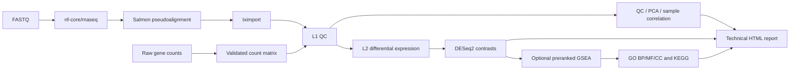

English | [繁體中文](README_zh-TW.md)

# nf-rna

`nf-rna` is a reproducible bulk RNA-seq analysis workflow for researchers who start with either FASTQ files or raw gene-count matrices. It turns validated project inputs into quality-control results, differential-expression and optional GSEA results, figures, tables, a technical report, and the provenance needed to understand how those results were produced.

For FASTQ projects, nf-rna supports pinned nf-core/rnaseq 3.26.0 + Salmon/tximport and an explicitly configured first-party HISAT2 + featureCounts route, both feeding first-party DESeq2 and clusterProfiler analysis. Scientific and execution settings are explicit rather than inferred, so the same declared project can be reviewed and rerun with a clear record of its inputs and choices.

The current patch version is `0.5.1`. Its stable CLI and Python namespace are both `rnaseq`. Development runs may use `rnaseq-control-plane:latest`; production-intended runs must request a digest or a versioned tag whose observed Docker image ID/digest is frozen in provenance.

## Overview

Bulk RNA-seq projects often arrive through two very different routes: raw reads that still need quantification, or a gene-count matrix supplied by another workflow. nf-rna gives both routes one validated downstream analysis path.

```text
FASTQ or raw counts
        ↓
validated project configuration
        ↓
RNA-seq analysis
        ↓
QC / DESeq2 / optional GSEA
        ↓
figures / tables / technical report / provenance
```

The result is a technical analysis package that is easier to inspect, reproduce, and hand off than an ad-hoc collection of scripts and output files.

## Workflow



L1 is the quality-control and exploratory-expression layer. L2 is selected explicitly and adds differential expression; GSEA is optional within L2. An L1 project does not run DESeq2 contrast testing or GSEA merely because contrast metadata is present.

## What nf-rna does

| Stage | Analysis | Main outputs |
| --- | --- | --- |
| FASTQ route | nf-core/rnaseq 3.26.0 with Salmon pseudoalignment | Standardized Salmon/tximport handoff and upstream QC artifacts |
| L1 | Filtering, normalization, blind VST, PCA, and sample correlation | QC tables, normalized counts, VST matrix, PCA and correlation figures |
| L2 | DESeq2 for configured contrasts | Differential-expression tables, volcano plots, and DEG heatmaps when applicable |
| GSEA | Preranked GO and KEGG GSEA | GO BP/MF/CC and KEGG term tables and dotplots when enabled |
| Reporting and delivery | Technical reporting, frozen configuration, and curated artifacts | HTML report, PNG and 300-dpi TIFF figures, tables, methods/version records, and provenance |

## Input routes

### FASTQ

```text
FASTQ → nf-core/rnaseq → Salmon → tximport → nf-rna downstream analysis
```

FASTQ projects support paired-end and single-end reads. They explicitly declare whether reads are `raw` or `pretrimmed`; nf-rna never infers that decision from a file name, directory name, or read content. Salmon handoff uses `salmon.merged.tx2gene_augmented.tsv`, the nf-core/rnaseq 3.26.0 mapping used by tximport, and freezes its path, role, mapping type and SHA-256. Historical ordinary mappings remain readable and are labelled as historical rather than augmented.

Use this route when nf-rna should own read processing as well as downstream analysis.

### FASTQ: HISAT2 + featureCounts

```text
FASTQ → fastp/FastQC → HISAT2 → sorted BAM → featureCounts → DESeqDataSetFromMatrix → nf-rna downstream analysis
```

Set `upstream.quantification.method: hisat2_featurecounts`, use a checksum-bound custom or local reference with a validated HISAT2 index, and declare `upstream.strandedness` as `unstranded`, `forward`, or `reverse`. A prebuilt index is a supported local-reference input: its manifest declares the index prefix, strategy, version, and matching FASTA/GTF/splice-site checksums. `auto` is intentionally rejected for this route. The default count contract is `exon`/`gene_id`; it excludes multimappers, multi-gene overlaps, fractional counts, and secondary/supplementary alignments. Before counting, a separate BAM excludes flags `0x100` and `0x800` while retaining the original diagnostic BAM and all alignment tags, so ambiguity remains detectable. Paired-end data use `-p --countReadPairs -B -C`; single-end data are counted as reads. These are nf-rna defaults, not universal recommendations.

`upstream.engine: nfcore_rnaseq` and `pipeline_version: "3.26.0"` remain required legacy FASTQ configuration fields for compatibility. They select and describe the Salmon implementation only. A HISAT2 run records `nf-rna/hisat2_featurecounts`, its nf-rna version, and the SHA-256 of `workflow/hisat2_featurecounts.nf` as the resolved executed implementation; it is never attributed to nf-core/rnaseq.

```yaml
schema_version: "1.2"
upstream:
  engine: nfcore_rnaseq
  pipeline_version: "3.26.0"
  strandedness: reverse
  quantification: {method: hisat2_featurecounts}
reference:
  source: custom
  fasta: reference/genome.fa
  gtf: reference/genes.gtf
  hisat2_index: reference/hisat2/index
```

For a managed local reference, register a compatible prebuilt HISAT2 index in `reference_manifest.yaml`, then run `rnaseq plan PROJECT` and `rnaseq run PROJECT --case-id CASE --profile local --yes`. `rnaseq reference prepare-hisat2` is an optional host-native builder, not a prerequisite. Raw and processed per-lane FastQC reports/archives are uniquely prefixed and included in MultiQC together with fastp JSON, HISAT2 summaries and featureCounts summaries. The route pins HISAT2 2.2.1, SAMtools 1.21, Subread/featureCounts 2.0.6, FastQC 0.12.1 and fastp 0.24.0 through Biocontainers build tags, plus MultiQC 1.33 through the Seqera Wave library.

### Raw counts

```text
gene-count matrix + metadata + contrasts → nf-rna → L1/L2
```

The raw-count route accepts a non-negative integral count matrix with `gene_id`, extensible metadata, and explicit directional contrasts. It is useful when quantification was performed elsewhere and you need validated QC, DESeq2, optional GSEA, reporting, and provenance without rerunning read processing.

Biological pairing is explicit: paired designs store `design.pairing_column`, validate one observation per requested condition in every block, and reject a rank-deficient additive model matrix before execution. This setting is independent of paired-end versus single-end FASTQ layout. Reports identify the actual import route as Salmon/tximport, featureCounts raw counts, or imported raw counts.

Production reference acceptance is opt-in with `reference.acceptance: production`. It accepts only a schema-1.1 managed local manifest deliberately marked `purpose: production`, with verified asset hashes and a complete selected-backend index bound to the same FASTA/GTF identities. Legacy and synthetic manifests still work in standard mode but are never silently promoted. The first documented human identity is Ensembl release 116, GRCh38.p14; no reference is downloaded in this repository.

See the [quick start](docs/quickstart.md) and [scientific contract](docs/scientific_contract.md) for the complete configuration rules.

## Quick start

### 1. Install

```bash
git clone https://github.com/2002brian/nf-rna.git
cd nf-rna
conda env create -f environment.yml
conda activate nf-rna
docker build -t rnaseq-control-plane:latest .
```

Python 3.11+ is required. The shared `environment.yml` is portable across Linux/WSL and Apple Silicon macOS; it deliberately contains no Linux-only `procps-ng` dependency. Install Nextflow before using the FASTQ route, and ensure Docker Desktop or another compatible Docker daemon is running. `latest` is permitted only for explicitly non-production development. Set `runtime.control_plane_image` to a digest or versioned tag for production acceptance; `rnaseq doctor PROJECT` reports both requested and observed identity.

Prebuilt Salmon and HISAT2 indexes are first-class managed-reference inputs:
declare their root-relative path/prefix, version, strategy, and matching source
checksums in `reference_manifest.yaml`. The optional builders are native, never
use Docker, and do not require RSEM. Create the separate pinned builder
environment only when you want nf-rna to construct a new index:

```bash
mamba env create -f environment.reference-builder.yml
mamba activate nf-rna-reference-builder
rnaseq reference prepare /absolute/reference-root --threads 4
rnaseq reference prepare-hisat2 /absolute/reference-root --threads 4
```

FASTQ analysis and downstream analysis retain their container execution
contracts. See [Runtime](docs/runtime.md) for the native tool/version policy,
atomic publication behavior, and HISAT2 memory warning.

The `rnaseq new` review also records a local aggregate execution budget. On a
20 CPU / 64 GiB machine it normally suggests 16 CPUs / 48 GiB, reserving room
for the OS, WSL and containers. This is an execution ceiling, not a scientific
parameter or a per-task allocation; existing projects retain the conservative
8 CPU / 12 GiB default.

For the production Human Ensembl 116/GRCh38.p14 genome-only HISAT2 bundle,
the registered GTF-derived splice-site file is supplied at runtime with
`--known-splicesite-infile`; it is not graph-embedded. Builder version and
runtime aligner version remain separate until a compatibility smoke test has
validated the pair. Tissue and cell-line libraries of the same species use the
same species/build/release reference; tissue identity does not select a new
genome reference.

### 2. Check the runtime

```bash
rnaseq doctor
```

`rnaseq doctor` reports non-mutating prerequisite checks for the local runtime; with a project path it also evaluates project and reference readiness. It reports host and Docker CPU/RAM, the selected local ceiling, and free space at the Nextflow work location. A warning means Docker exposes less than the requested 8 CPUs or 12 GiB.

Execution is currently local-only. Workstation/HPC and SLURM profiles are intentionally deferred and are not claimed by version 0.5.1.

### 3. Try the included smoke test

```bash
rnaseq validate examples/nfcore_smoke_test
rnaseq plan examples/nfcore_smoke_test
rnaseq run examples/nfcore_smoke_test --case-id SMOKE-001 --profile local --yes
```

- `validate` verifies the project inputs and configuration without running analysis.
- `plan` previews and records the intended analysis after validation.
- `run` performs a real immutable analysis run. It can pull containers, process the public fixture, and use local compute and storage.

The bundled smoke fixture is an integration check, not a biological study and not a basis for biological interpretation.

### 4. Start your own project

```bash
cd ~/projects/rnaseq-projects
conda activate nf-rna
rnaseq new
```

The normal interactive wizard is scaffold-first: it asks the scientific and execution configuration, shows a review, then creates `project.yaml`, `metadata.csv`, `contrasts.csv`, `input/`, and `planning/` without copying data. The review explicitly says that inputs have not been imported. Then enter the new project, add data, and complete the templates:

```bash
cd <new-project>
# add FASTQs to input/fastq/, or a matrix to input/counts.csv
# complete metadata.csv and contrasts.csv
rnaseq validate .
rnaseq plan .
rnaseq doctor .
rnaseq run . --case-id CASE-001 --profile local --yes
```

Populate `input/` with either your FASTQs or count matrix; complete metadata with `sample_id` and every design-formula variable; and provide directional contrasts for L2 differential-expression work.

The wizard supports Human and Mouse only, offers Salmon or HISAT2 + featureCounts for FASTQ, and displays a review before it writes anything. At choice prompts, standard readline-enabled Linux/WSL and macOS terminals can complete canonical values with Tab (for example, `h` to `hisat2_featurecounts`); ambiguous prefixes remain unresolved and terminals without readline retain the typed prompt. Path prompts deliberately remain separate typed inputs. Explicit flags retain the import workflow: `--fastq-samplesheet` copies a strict FASTQ samplesheet (`sample,fastq_1,fastq_2,strandedness`) and lane files, while `--counts --metadata --contrasts` copies a raw integer count matrix and its design files. For repeatable automation, use the same choices explicitly; this example imports raw counts without prompts:

```bash
rnaseq new --name demo --destination projects --species human \
  --input-type raw_counts --counts source/counts.csv \
  --metadata source/metadata.csv --contrasts source/contrasts.csv \
  --preset L2 --design-type two_group --condition-column condition --yes
```

The ordinary interactive command already creates this scaffold. `--scaffold` remains available for explicit non-interactive template creation. The resulting project is intentionally incomplete and `rnaseq validate` will say what remains. FASTQ `--preset qc` runs quantification and technical QC only; it does not start the metadata-dependent statistical workflow.

## What you get

Every authorized execution creates a new run beneath `runs/<case-id>/<run-id>/`. The curated client-facing content is assembled into `delivery/`; operational caches and work directories remain outside the delivery package.

```text
runs/<case-id>/<run-id>/
├── delivery/
│   ├── figures/png/
│   ├── figures/tiff_300dpi/
│   ├── tables/
│   ├── methods_and_versions/
│   └── report_YYYYMMDD.html
├── downstream/
│   ├── l1/
│   ├── l2/                         # L2 projects only
│   └── report/report.html
└── provenance/
```

Depending on the selected route and analysis level, the package can include QC figures, PCA, sample-correlation results, normalized-count and expression summaries, differential-expression tables, volcano plots, DEG heatmaps, GO GSEA and KEGG GSEA results, a technical HTML report, and frozen configuration/provenance records. Figures are delivered as PNG and 300-dpi TIFF; no PDF or SVG delivery format is produced.

New deliveries label source matrices under `delivery/counts/`: imported and
featureCounts inputs use `raw_counts.csv`; Salmon/tximport uses
`estimated_counts.csv` because those values are estimates and may be
non-integer; `vst.csv` is transformed expression for visualization. The count
artifact manifest records checksum and sample order. Fit DESeq2 from the
source-appropriate raw/estimated matrix, never VST, and do not compare raw
count magnitudes across samples without normalization.

## Scientific defaults

| Component | Default or contract |
| --- | --- |
| Differential expression | DESeq2 with the validated additive design and configured directional contrast |
| Effect direction | `log2FC > 0` means higher expression in the contrast numerator |
| Significance | `padj < thresholds.padj` and `abs(log2FoldChange) >= thresholds.abs_log2fc` (template values: `0.05` and `1.0`) |
| Multiple testing and LFC | DESeq2 native independent filtering and Benjamini–Hochberg adjustment; unshrunken log2 fold changes |
| GSEA ranking | All finite tested-gene DESeq2 Wald statistics, with no DEG, p-value, adjusted-p-value, or effect-size prefilter |
| GO GSEA | BP, MF, and CC using supported local organism annotation packages |
| KEGG GSEA | clusterProfiler through the declared online KEGG route |
| FASTQ quantification | Salmon pseudoalignment through pinned nf-core/rnaseq 3.26.0, then tximport |
| Raw-count input | DESeq2 `DESeqDataSetFromMatrix` from the validated count matrix and metadata |

See [docs/scientific_contract.md](docs/scientific_contract.md) for the complete scientific contract and its boundaries.

## Reproducibility and safety

nf-rna validates inputs before analysis and does not silently add metadata variables, reinterpret preprocessing, change references, or alter statistical settings. Planning records the intended analysis deterministically for unchanged inputs.

Each execution creates a new immutable run directory rather than overwriting an earlier analysis. The run stores its frozen configuration, selected reference strategy, runtime facts, and provenance, making it possible to trace which declared inputs and settings produced a result. FASTQ runs freeze one resolved local Nextflow configuration and its SHA-256, then pass that same configuration to nf-core Salmon, HISAT2/featureCounts, and the downstream workflow. The downstream R runtime is containerized, while bounded local resource profiles help avoid uncontrolled Docker oversubscription without changing the scientific calculation.

## Architecture

| Layer | Responsibility |
| --- | --- |
| Python control plane | Creates projects, validates contracts, plans work, freezes execution inputs, and assembles delivery artifacts |
| Nextflow and nf-core | Orchestrates FASTQ processing and the downstream workflow graph |
| R statistical backend | Runs L1 QC, DESeq2, GSEA, and plot generation from the frozen configuration |

Read the concise [architecture guide](docs/architecture.md) for lifecycle and data-flow details.

## Validation

At the public-packaging review, the non-expensive regression suite completed with **187 passed, 1 deselected**. The deselected test is an explicitly expensive L2 determinism test. A fresh L1 FASTQ smoke run also completed upstream nf-core/Salmon processing, immutable handoff staging, L1 analysis, L1-only reporting, and delivery assembly without invoking control-plane L2 or GSEA.

These are software and regression checks. They demonstrate that the implemented workflow paths behaved as expected for their fixtures; they do not establish biological validity for a new study or replace experimental-design review.

Milestone A adds a hand-constructed real-tool featureCounts fixture. It verifies single-end reads, paired fragments, forward/reverse strand selection, multimapper and overlapping-gene exclusion, both-mates and chimeric-fragment policy, secondary/supplementary exclusion, and technical-lane merge counts. It is supplementary host validation, not a substitute for the pinned-container smoke run; see [runtime](docs/runtime.md) for the recorded status.

## Requirements and limitations

- Python 3.11+, Docker, and adequate local storage are required.
- Nextflow is required for the FASTQ route.
- Host/container architecture, image availability, and registry access remain runtime responsibilities.
- L2 inference requires appropriate biological replication; nf-rna does not make an unreplicated 1-vs-1 comparison suitable for DESeq2 inference.
- KEGG GSEA depends on the declared online KEGG route and may report network unavailability.
- nf-rna produces technical analysis artifacts only; it does not provide clinical decisions or biological interpretation.

## Documentation

| Document | Purpose |
| --- | --- |
| [Architecture](docs/architecture.md) | Lifecycle, data flow, immutable runs, and execution boundaries |
| [Scientific contract](docs/scientific_contract.md) | Input, DESeq2, GSEA, reference, and interpretation rules |
| [Runtime](docs/runtime.md) | Docker, Nextflow, local resource profiles, and filesystem expectations |
| [Quick start](docs/quickstart.md) | Detailed setup and project-configuration examples |
| [Workflow README](workflow/README.md) | Downstream Nextflow graph and resource-policy details |

## Citation and license

nf-rna version metadata is prepared for `v0.5.1` under the [MIT License](LICENSE). Cite the specific tagged release you use; the machine-readable record is [CITATION.cff](CITATION.cff).
