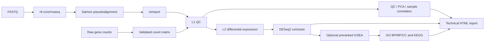

[English](README.md) | 繁體中文

# nf-rna

> 本文件為繁體中文翻譯；若與英文版內容有差異，以英文版 README.md 為準。

`nf-rna` 是一套可重現的 bulk RNA-seq 分析 workflow，適用於以 FASTQ 或 raw gene-count matrix 為起點的研究者。它會將通過驗證的專案輸入轉換為品質控制結果、差異表現與選用的 GSEA 結果、圖表、technical report，以及用來追溯結果產生方式的 provenance。

對於 FASTQ 專案，nf-rna 將固定版本的 nf-core/rnaseq 3.26.0、Salmon 與 tximport，結合 first-party 的 DESeq2 和 clusterProfiler 分析。科學與執行設定都必須明確宣告，而非由系統猜測；因此，同一個已宣告的專案可以被審查與重跑，並保有清楚的輸入與設定紀錄。

目前 patch 版本為 `0.5.1`，穩定的 CLI 與 Python namespace 都是 `rnaseq`。開發模式可使用 `rnaseq-control-plane:latest`；production-intended run 必須指定 digest 或 versioned tag，並將 Docker 實際觀察到的 image ID/digest 凍結於 provenance。

## 概覽

bulk RNA-seq 專案通常從兩種不同的輸入開始：仍需 quantification 的 raw reads，或由其他 workflow 產生的 gene-count matrix。nf-rna 為兩種路徑提供同一套經驗證的 downstream analysis。

```text
FASTQ or raw counts
        ↓
validated project configuration
        ↓
RNA-seq analysis
        ↓
QC / DESeq2 / optional GSEA
        ↓
figures / tables / technical report / provenance
```

最終得到的是可檢視、可重現且便於交接的技術分析套件，而不是一組難以追溯的 script 與 output file。

## Workflow



L1 是品質控制與探索性表現分析層；L2 必須明確選擇，才會加入差異表現分析；GSEA 則是 L2 中的選用功能。即使專案中已有 contrast metadata，L1 專案也不會執行 DESeq2 contrast testing 或 GSEA。

## nf-rna 能做什麼

| 階段 | 分析內容 | 主要輸出 |
| --- | --- | --- |
| FASTQ route | 以 Salmon pseudoalignment 執行 nf-core/rnaseq 3.26.0 | Standardized Salmon/tximport handoff 與 upstream QC artifact |
| L1 | Filtering、normalization、blind VST、PCA 與 sample correlation | QC table、normalized counts、VST matrix、PCA 與 correlation figure |
| L2 | 針對設定的 contrast 執行 DESeq2 | Differential-expression table、volcano plot，以及適用時的 DEG heatmap |
| GSEA | Preranked GO 與 KEGG GSEA | 啟用時產生 GO BP/MF/CC 與 KEGG term table、dotplot |
| Reporting 與 delivery | Technical report、frozen configuration 與篩選後 artifact | HTML report、PNG 與 300-dpi TIFF figure、table、methods/version record 與 provenance |

## 輸入路徑

### FASTQ

```text
FASTQ → nf-core/rnaseq → Salmon → tximport → nf-rna downstream analysis
```

FASTQ 專案支援 paired-end 與 single-end reads。使用者必須明確指定 reads 是 `raw` 或 `pretrimmed`；nf-rna 不會根據檔名、directory 名稱或 read 內容推斷此設定。Salmon handoff 使用 nf-core/rnaseq 3.26.0 實際交給 tximport 的 `salmon.merged.tx2gene_augmented.tsv`，並凍結 path、role、mapping type 與 SHA-256。歷史 ordinary mapping 仍可讀取，但會如實標示為 historical，而不宣稱是 augmented。

若希望 nf-rna 同時負責 read processing 與 downstream analysis，請使用此路徑。

### FASTQ：HISAT2 + featureCounts

```text
FASTQ → fastp/FastQC → HISAT2 → sorted BAM → featureCounts → DESeqDataSetFromMatrix → nf-rna downstream analysis
```

在 `upstream.quantification.method` 指定 `hisat2_featurecounts`，並使用已準備 HISAT2 index 的 checksum-bound custom 或 local reference。此 route 必須明確指定 `upstream.strandedness: unstranded|forward|reverse`；`auto` 會被拒絕，Milestone A 不提供 strand inference。預設以 `exon`/`gene_id` 計數，不納入 multimapper、跨 gene ambiguous assignment、fractional count，或 secondary/supplementary alignment。計數前會產生只排除 `0x100` 與 `0x800` flags 的獨立 BAM，同時保留原始 diagnostic BAM 與所有 alignment tags，因此仍可辨識 ambiguous mapping。paired-end 使用 `-p --countReadPairs -B -C`，single-end 以 read 計數；這些是 nf-rna 預設，並非所有實驗的通用建議。

為了相容既有 FASTQ project，`upstream.engine: nfcore_rnaseq` 與 `pipeline_version: "3.26.0"` 仍是必要的 legacy configuration fields；它們只描述並選擇 Salmon implementation。HISAT2 run 會將實際執行 implementation 記錄為 `nf-rna/hisat2_featurecounts`、nf-rna version 與 `workflow/hisat2_featurecounts.nf` 的 SHA-256，絕不會歸因為 nf-core/rnaseq。

Local reference 請先執行 `rnaseq reference prepare-hisat2 /absolute/reference-root`，再執行 `rnaseq plan PROJECT` 與 `rnaseq run PROJECT --case-id CASE --profile local --yes`。raw 與 processed 的 per-lane FastQC report/archive 會加上不同 prefix 防止碰撞，並與 fastp JSON、HISAT2 summary、featureCounts summary 一起送入 MultiQC。此 route 固定 HISAT2 2.2.1、SAMtools 1.21、Subread/featureCounts 2.0.6、FastQC 0.12.1、fastp 0.24.0 與 MultiQC 1.33。

### Milestone A 驗證（2026-09-05）

已在 arm64 Docker Desktop 上以 amd64 emulation 執行 production pinned SAMtools 1.21 與 featureCounts 2.0.6 的語意 fixture；single-end、paired fragment、forward/reverse strand、overlap/multimapper、secondary/supplementary、both-mates、chimeric fragment 與 technical-lane merge 都符合預期。`samtools view -bh -F 0x900` 移除 multimapper secondary record 後，保留下來的 primary `NH:i:2` 仍被 featureCounts 排除，沒有被誤當作 unique read。

同日以目前 checkout 建立的 arm64 control-plane image（ID `sha256:dc5cd9f336c411eb65ac80c360e6a7abe9f40acfa6cd86fcab05018b073d3171`）完成 raw L2 run `MILESTONE-A-RAW-L2-FINAL/20260905-115310+0800`，並另完成 pretrimmed L1 run `MILESTONE-A-PRETRIMMED-L1/20260905-115200+0800`。raw L2 run 實際產出 original/count-only BAM lineage、alignment/QC、featureCounts、canonical matrix/sample map、`featurecounts_raw_counts` → `DESeqDataSetFromMatrix`、L1、L2、report 與 delivery；完整機器可讀證據位於 immutable run directory。此小型合成資料未啟用 enrichment，因此驗證的是文件化的 no-enrichment graceful route，不宣稱 GO/KEGG 生物學結果。

獨立的 interactive single-end QC 驗收 run `WIZARD-HISAT2-QC-R3/20260905-144237+0800` 亦於同日通過；它僅以 single-end synthetic fixture 驗證 raw preprocessing、HISAT2、featureCounts、FastQC/MultiQC 與 QC delivery，沒有宣稱 paired fragment accounting 或 L1/L2/enrichment。這些項目分別由後述 paired UAT 與上述 Milestone A smoke records 支持。

同日的 interactive paired-end QC 驗收 run 為 `PAIRED-HISAT2-QC-UAT-R3/20260905-150643+0800`；其 immutable validation record 保留於未發布的本機 workspace。可重現的小型合成 fixture 位於 `tests/fixtures/hisat2_paired_raw_v2`；在空白 destination 用 `python tests/fixtures/hisat2_paired_raw/generate_fixture.py --root PATH/TO/EMPTY/hisat2_paired_raw_v2` 產生後，再以 `rnaseq reference prepare-hisat2 PATH/TO/EMPTY/hisat2_paired_raw_v2/reference` 建立 managed index。fixture 是 forward stranded（HISAT2 `FR`、featureCounts `-s 1`），PairAlpha 的兩條 technical lane 應合併為 `GeneA=3, GeneB=1`，獨立 PairBeta 應為 `GeneA=0, GeneB=2`。實際 run 的 raw/retained R1/R2 均同步；每條 lane 的 adapter pair 都被剪除 2 reads／66 bases、mapping rate 100%，且 canonical matrix 與先驗值完全一致。featureCounts 使用 `-p --countReadPairs -B -C`；PairAlpha 的 8 個 alignment records 代表 4 個 fragments，PairBeta 的 4 個 records 代表 2 個 fragments，兩者不可混為同一數量。original/count-only BAM 均通過 `samtools quickcheck`，count-only BAM 沒有 `0x900` records 且所有 mapped records 保有 `NH:i:1`。MultiQC 含 FastQC、fastp、HISAT2、featureCounts；QC scope 沒有執行 L1/L2/enrichment。這是 software-contract fixture，不是 biological evidence。

### Raw counts

```text
gene-count matrix + metadata + contrasts → nf-rna → L1/L2
```

raw-count route 接受第一欄為 `gene_id` 的非負整數 count matrix、可擴充的 metadata，以及明確具有方向性的 contrast。若 quantification 已由其他 workflow 完成，但仍需要經驗證的 QC、DESeq2、選用的 GSEA、report 與 provenance，而不想重新處理 reads，此路徑最合適。

生物學 pairing 必須明確設定：paired design 會保存 `design.pairing_column`，驗證每個 block 對 requested condition 各有一個 observation，並在 execution 前拒絕 rank-deficient additive model matrix。這與 FASTQ 的 paired-end／single-end layout 無關。Report 會依實際來源標示 Salmon/tximport、featureCounts raw counts 或 imported raw counts。

Production reference acceptance 以 `reference.acceptance: production` 明確啟用，只接受 schema 1.1、經人工指定 `purpose: production` 的 managed local manifest；所有 asset hash 必須通過驗證，所選 backend index 也必須完整並綁定相同 FASTA/GTF identity。Legacy 與 synthetic manifest 在 standard mode 仍可使用，但不會被靜默升級為 production。第一個文件化的人類 identity 為 Ensembl release 116、GRCh38.p14；本 repository 不下載 reference。

完整的設定規則請參閱 [quick start](docs/quickstart.md) 與 [scientific contract](docs/scientific_contract.md)。

## 快速開始

### 1. 安裝

```bash
git clone https://github.com/2002brian/nf-rna.git
cd nf-rna
conda env create -f environment.yml
conda activate nf-rna
docker build -t rnaseq-control-plane:latest .
```

需要 Python 3.11 以上版本。使用 FASTQ route 前，請安裝 Nextflow，並確認 Docker Desktop 或其他相容的 Docker daemon 已啟動。`latest` 僅可用於明確的 non-production 開發模式；production acceptance 必須將 `runtime.control_plane_image` 設為 digest 或 versioned tag，`rnaseq doctor PROJECT` 會同時報告 requested 與 observed identity。

Managed Salmon 與 HISAT2 index 必須以 host-native 方式建立，不使用 Docker：

```bash
mamba env create -f environment.reference-builder.yml
mamba activate nf-rna-reference-builder
rnaseq reference prepare /absolute/reference-root --threads 4
rnaseq reference prepare-hisat2 /absolute/reference-root --threads 4
```

FASTQ 與 downstream analysis 仍使用既有的 container execution contract。native tool/version policy、atomic publication 與 HISAT2 memory warning 請見 [Runtime](docs/runtime.md)。

production Human Ensembl 116/GRCh38.p14 的 genome-only HISAT2 bundle 會在 runtime 以 `--known-splicesite-infile` 傳入由已註冊 GTF 產生的 splice-site file；splice site 並未嵌入 index graph。builder version 與 runtime aligner version 會分開記錄，並在 compatibility smoke test 通過前維持明確的驗證需求。同一 species/build/release 的 tissue 與 cell-line library 共用同一 reference；tissue identity 不會選擇另一個 genome reference。

此 Human reference 的 tiny FASTQ smoke fixture 僅用於技術性 software-contract validation，不是 biological evidence，也不得用於 tissue 或 disease interpretation。

### 2. 檢查 runtime

```bash
rnaseq doctor
```

`rnaseq doctor` 會以不變更系統狀態的方式檢查 local runtime prerequisite；提供專案路徑時，也會評估 project 與 reference readiness。它會報告 host 與 Docker 的 CPU/RAM、選定的 local ceiling，以及 Nextflow work location 的可用空間；Docker 少於要求的 8 CPU 或 12 GiB 時會提出警告。

目前僅支援 local execution；workstation/HPC 與 SLURM profile 明確延後，0.5.1 不宣稱支援。

### 3. 嘗試隨附的 smoke test

```bash
rnaseq validate examples/nfcore_smoke_test
rnaseq plan examples/nfcore_smoke_test
rnaseq run examples/nfcore_smoke_test --case-id SMOKE-001 --profile local --yes
```

- `validate` 驗證 project input 與 configuration，不會執行分析。
- `plan` 在驗證通過後預覽並記錄預定的分析內容。
- `run` 會執行真正的 immutable analysis run；它可能下載 container、處理公開 fixture，並使用本機 compute 與 storage。

隨附的 smoke fixture 是 integration check，不是 biological study，也不能作為 biological interpretation 的依據。

### 4. 建立自己的專案

```bash
rnaseq new
```

這個互動式命令會建立 `project.yaml`、`metadata.csv`、`contrasts.csv`、`input/` 與 `planning/`。請在 `input/` 放入 FASTQ 或 count matrix；在 metadata 中填入 `sample_id` 與 design formula 使用的每個 variable；若要進行 L2 differential-expression analysis，則提供具有方向性的 contrast。

wizard 僅提供 Human 與 Mouse，FASTQ 可選 Salmon 或 HISAT2 + featureCounts，寫入前會顯示完整 review。它可匯入嚴格四欄 FASTQ samplesheet（`sample,fastq_1,fastq_2,strandedness`）並保留 lane 檔名，或複製 raw integer count matrix、metadata 與 contrasts。可重複執行的自動化使用相同選項，例如：

```bash
rnaseq new --name demo --destination projects --species human \
  --input-type raw_counts --counts source/counts.csv \
  --metadata source/metadata.csv --contrasts source/contrasts.csv \
  --preset L2 --design-type two_group --condition-column condition --yes
```

輸入尚未備妥時可使用 `--scaffold`；建立的 project 會刻意保持 incomplete，`rnaseq validate` 會說明缺少項目。FASTQ 的 `--preset qc` 僅執行 quantification 與 technical QC，不會啟動依賴 metadata 的統計分析流程。

## 執行後會得到什麼

每次授權執行都會在 `runs/<case-id>/<run-id>/` 下建立新的 run。面向使用者的精選結果會組裝到 `delivery/`；operational cache 與 work directory 不會放入 delivery package。

```text
runs/<case-id>/<run-id>/
├── delivery/
│   ├── figures/png/
│   ├── figures/tiff_300dpi/
│   ├── tables/
│   ├── methods_and_versions/
│   └── report_YYYYMMDD.html
├── downstream/
│   ├── l1/
│   ├── l2/                         # L2 projects only
│   └── report/report.html
└── provenance/
```

實際交付內容會依 input route 與 analysis level 而定，可能包括 QC figure、PCA、sample-correlation result、normalized-count 與 expression summary、differential-expression table、volcano plot、DEG heatmap、GO GSEA 與 KEGG GSEA 結果、technical HTML report，以及 frozen configuration/provenance record。圖形以 PNG 與 300-dpi TIFF 交付；不產生 PDF 或 SVG 格式。

新 delivery 會在 `delivery/counts/` 以來源語意標示 matrix：imported 與 featureCounts 的 integer input 為 `raw_counts.csv`；Salmon/tximport 為可能含非整數估計值的 `estimated_counts.csv`；`vst.csv` 是供視覺化的 transformed expression。count artifact manifest 會記錄 checksum 與 sample order。DESeq2 應使用來源正確的 raw/estimated matrix，而非 VST；未經適當 normalization，不應直接比較不同 sample 的 raw-count magnitude。

## 科學分析預設與契約

| 元件 | 預設或契約 |
| --- | --- |
| Differential expression | 依通過驗證的 additive design 與設定的 directional contrast 執行 DESeq2 |
| Effect direction | `log2FC > 0` 表示 contrast numerator 的表現量較高 |
| Significance | `padj < thresholds.padj` 且 `abs(log2FoldChange) >= thresholds.abs_log2fc`（template 值為 `0.05` 與 `1.0`） |
| Multiple testing 與 LFC | 使用 DESeq2 native independent filtering 與 Benjamini–Hochberg adjustment；保留未 shrink 的 log2 fold change |
| GSEA ranking | 使用所有有限的 tested-gene DESeq2 Wald statistic，不進行 DEG、p-value、adjusted-p-value 或 effect-size prefilter |
| GO GSEA | 使用支援的 local organism annotation package，分析 BP、MF、CC |
| KEGG GSEA | 透過宣告的 online KEGG route 使用 clusterProfiler |
| FASTQ quantification | 由固定版本的 nf-core/rnaseq 3.26.0 以 Salmon pseudoalignment 處理，再交由 tximport |
| Raw-count input | 由通過驗證的 count matrix 與 metadata 建立 DESeq2 `DESeqDataSetFromMatrix` |

完整的 scientific contract 與適用範圍請參閱 [docs/scientific_contract.md](docs/scientific_contract.md)。

## 可重現性與安全性

nf-rna 會在分析前驗證 input；不會靜默加入 metadata variable、重新解讀 preprocessing、變更 reference，或修改統計設定。對於未變動的 input，planning 會以 deterministic 方式記錄預定分析。

每次 execution 都會建立新的 immutable run directory，而非覆寫先前分析。run 會保存 frozen configuration、選用的 reference strategy、runtime fact 與 provenance，因此可以追溯某項結果是由哪些已宣告的 input 與設定產生。FASTQ run 會凍結同一份 resolved local Nextflow configuration 與其 SHA-256，並傳入 nf-core Salmon、HISAT2/featureCounts 與 downstream workflow。downstream R runtime 以 container 執行；bounded local resource profile 則有助於避免 Docker 不受控的資源超額使用，而不改變任何科學計算。

## 架構

| 層級 | 職責 |
| --- | --- |
| Python control plane | 建立專案、驗證 contract、規劃工作、凍結 execution input，並組裝 delivery artifact |
| Nextflow 與 nf-core | 協調 FASTQ processing 與 downstream workflow graph |
| R statistical backend | 依 frozen configuration 執行 L1 QC、DESeq2、GSEA 與 plot generation |

關於 lifecycle 與 data flow，請閱讀精簡的 [architecture guide](docs/architecture.md)。

## 驗證狀態

在公開包裝審查時，非昂貴的 regression suite 完成 **187 passed, 1 deselected**；被排除的是一項明確標示為昂貴的 L2 determinism test。新的 L1 FASTQ smoke run 也已完成 upstream nf-core/Salmon processing、immutable handoff staging、L1 analysis、L1-only reporting 與 delivery assembly，且未呼叫 control-plane L2 或 GSEA。

這些是 software 與 regression check，代表已實作的 workflow path 在對應 fixture 上如預期運作；它們不代表新的研究已取得 biological validity，也不能取代 experimental-design review。

Milestone A 新增 hand-constructed 的 real-tool featureCounts fixture，驗證 single-end、paired fragment、forward/reverse strandedness、multimapper 與 overlapping-gene 排除、both-mates/chimeric policy、secondary/supplementary 排除，以及 technical-lane merge count。這是補充的 host validation，不取代 pinned-container smoke run；實際狀態請見 [runtime](docs/runtime.md)。

## Requirement 與限制

- 需要 Python 3.11 以上、Docker 與足夠的 local storage。
- FASTQ route 需要 Nextflow。
- Host/container architecture、image availability 與 registry access 仍是 runtime responsibility。
- L2 inference 需要適當的 biological replication；nf-rna 不會使無 replicate 的 1-vs-1 comparison 適合進行 DESeq2 inference。
- KEGG GSEA 依賴宣告的 online KEGG route，可能回報 network unavailable。
- nf-rna 只產生技術分析成果；不提供 clinical decision 或 biological interpretation。

## 文件導覽

| 文件 | 用途 |
| --- | --- |
| [Architecture](docs/architecture.md) | Lifecycle、data flow、immutable run 與 execution boundary |
| [Scientific contract](docs/scientific_contract.md) | Input、DESeq2、GSEA、reference 與 interpretation 規則 |
| [Runtime](docs/runtime.md) | Docker、Nextflow、local resource profile 與 filesystem expectation |
| [Quick start](docs/quickstart.md) | 詳細的 setup 與 project-configuration example |
| [Workflow README](workflow/README.md) | Downstream Nextflow graph 與 resource-policy detail |

## Citation 與 license

nf-rna 的版本 metadata 已準備為 `v0.5.1`，採用 [MIT License](LICENSE)。請引用實際使用的 tagged release；機器可讀紀錄位於 [CITATION.cff](CITATION.cff)。
