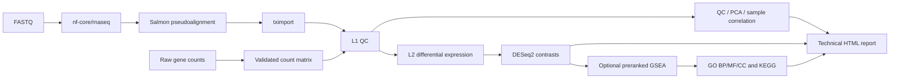

[English](README.md) | 繁體中文

# nf-rna

> 本文件為繁體中文翻譯；若與英文版內容有差異，以英文版 README.md 為準。

`nf-rna` 是一套可重現的 bulk RNA-seq 分析 workflow，適用於以 FASTQ 或 raw gene-count matrix 為起點的研究者。它會將通過驗證的專案輸入轉換為品質控制結果、差異表現與選用的 GSEA 結果、圖表、technical report，以及用來追溯結果產生方式的 provenance。

對於 FASTQ 專案，nf-rna 將固定版本的 nf-core/rnaseq 3.26.0、Salmon 與 tximport，結合 first-party 的 DESeq2 和 clusterProfiler 分析。科學與執行設定都必須明確宣告，而非由系統猜測；因此，同一個已宣告的專案可以被審查與重跑，並保有清楚的輸入與設定紀錄。

公開專案名稱為 `nf-rna`（`v0.4.3`）。穩定的 CLI 與 Python namespace 都是 `rnaseq`；為了相容既有 immutable run 的 provenance，已驗證的 production Docker image 維持為 `rnaseq-control-plane:latest`。

## 概覽

bulk RNA-seq 專案通常從兩種不同的輸入開始：仍需 quantification 的 raw reads，或由其他 workflow 產生的 gene-count matrix。nf-rna 為兩種路徑提供同一套經驗證的 downstream analysis。

```text
FASTQ or raw counts
        ↓
validated project configuration
        ↓
RNA-seq analysis
        ↓
QC / DESeq2 / optional GSEA
        ↓
figures / tables / technical report / provenance
```

最終得到的是可檢視、可重現且便於交接的技術分析套件，而不是一組難以追溯的 script 與 output file。

## Workflow



L1 是品質控制與探索性表現分析層；L2 必須明確選擇，才會加入差異表現分析；GSEA 則是 L2 中的選用功能。即使專案中已有 contrast metadata，L1 專案也不會執行 DESeq2 contrast testing 或 GSEA。

## nf-rna 能做什麼

| 階段 | 分析內容 | 主要輸出 |
| --- | --- | --- |
| FASTQ route | 以 Salmon pseudoalignment 執行 nf-core/rnaseq 3.26.0 | Standardized Salmon/tximport handoff 與 upstream QC artifact |
| L1 | Filtering、normalization、blind VST、PCA 與 sample correlation | QC table、normalized counts、VST matrix、PCA 與 correlation figure |
| L2 | 針對設定的 contrast 執行 DESeq2 | Differential-expression table、volcano plot，以及適用時的 DEG heatmap |
| GSEA | Preranked GO 與 KEGG GSEA | 啟用時產生 GO BP/MF/CC 與 KEGG term table、dotplot |
| Reporting 與 delivery | Technical report、frozen configuration 與篩選後 artifact | HTML report、PNG 與 300-dpi TIFF figure、table、methods/version record 與 provenance |

## 輸入路徑

### FASTQ

```text
FASTQ → nf-core/rnaseq → Salmon → tximport → nf-rna downstream analysis
```

FASTQ 專案支援 paired-end 與 single-end reads。使用者必須明確指定 reads 是 `raw` 或 `pretrimmed`；nf-rna 不會根據檔名、directory 名稱或 read 內容推斷此設定。reference strategy 同樣必須明確宣告，包括選用的 local reference 或支援的 iGenomes route。

若希望 nf-rna 同時負責 read processing 與 downstream analysis，請使用此路徑。

### Raw counts

```text
gene-count matrix + metadata + contrasts → nf-rna → L1/L2
```

raw-count route 接受第一欄為 `gene_id` 的非負整數 count matrix、可擴充的 metadata，以及明確具有方向性的 contrast。若 quantification 已由其他 workflow 完成，但仍需要經驗證的 QC、DESeq2、選用的 GSEA、report 與 provenance，而不想重新處理 reads，此路徑最合適。

完整的設定規則請參閱 [quick start](docs/quickstart.md) 與 [scientific contract](docs/scientific_contract.md)。

## 快速開始

### 1. 安裝

```bash
git clone https://github.com/2002brian/nf-rna.git
cd nf-rna
conda env create -f environment.yml
conda activate nf-rna
docker build -t rnaseq-control-plane:latest .
```

需要 Python 3.11 以上版本。使用 FASTQ route 前，請安裝 Nextflow，並確認 Docker Desktop 或其他相容的 Docker daemon 已啟動。

### 2. 檢查 runtime

```bash
rnaseq doctor
```

`rnaseq doctor` 會以不變更系統狀態的方式檢查 local runtime prerequisite；提供專案路徑時，也會評估 project 與 reference readiness。

### 3. 嘗試隨附的 smoke test

```bash
rnaseq validate examples/nfcore_smoke_test
rnaseq plan examples/nfcore_smoke_test
rnaseq run examples/nfcore_smoke_test --case-id SMOKE-001 --profile local --yes
```

- `validate` 驗證 project input 與 configuration，不會執行分析。
- `plan` 在驗證通過後預覽並記錄預定的分析內容。
- `run` 會執行真正的 immutable analysis run；它可能下載 container、處理公開 fixture，並使用本機 compute 與 storage。

隨附的 smoke fixture 是 integration check，不是 biological study，也不能作為 biological interpretation 的依據。

### 4. 建立自己的專案

```bash
rnaseq new
```

這個互動式命令會建立 `project.yaml`、`metadata.csv`、`contrasts.csv`、`input/` 與 `planning/`。請在 `input/` 放入 FASTQ 或 count matrix；在 metadata 中填入 `sample_id` 與 design formula 使用的每個 variable；若要進行 L2 differential-expression analysis，則提供具有方向性的 contrast。

## 執行後會得到什麼

每次授權執行都會在 `runs/<case-id>/<run-id>/` 下建立新的 run。面向使用者的精選結果會組裝到 `delivery/`；operational cache 與 work directory 不會放入 delivery package。

```text
runs/<case-id>/<run-id>/
├── delivery/
│   ├── figures/png/
│   ├── figures/tiff_300dpi/
│   ├── tables/
│   ├── methods_and_versions/
│   └── report_YYYYMMDD.html
├── downstream/
│   ├── l1/
│   ├── l2/                         # L2 projects only
│   └── report/report.html
└── provenance/
```

實際交付內容會依 input route 與 analysis level 而定，可能包括 QC figure、PCA、sample-correlation result、normalized-count 與 expression summary、differential-expression table、volcano plot、DEG heatmap、GO GSEA 與 KEGG GSEA 結果、technical HTML report，以及 frozen configuration/provenance record。圖形以 PNG 與 300-dpi TIFF 交付；不產生 PDF 或 SVG 格式。

## 科學分析預設與契約

| 元件 | 預設或契約 |
| --- | --- |
| Differential expression | 依通過驗證的 additive design 與設定的 directional contrast 執行 DESeq2 |
| Effect direction | `log2FC > 0` 表示 contrast numerator 的表現量較高 |
| Significance | `padj < thresholds.padj` 且 `abs(log2FoldChange) >= thresholds.abs_log2fc`（template 值為 `0.05` 與 `1.0`） |
| Multiple testing 與 LFC | 使用 DESeq2 native independent filtering 與 Benjamini–Hochberg adjustment；保留未 shrink 的 log2 fold change |
| GSEA ranking | 使用所有有限的 tested-gene DESeq2 Wald statistic，不進行 DEG、p-value、adjusted-p-value 或 effect-size prefilter |
| GO GSEA | 使用支援的 local organism annotation package，分析 BP、MF、CC |
| KEGG GSEA | 透過宣告的 online KEGG route 使用 clusterProfiler |
| FASTQ quantification | 由固定版本的 nf-core/rnaseq 3.26.0 以 Salmon pseudoalignment 處理，再交由 tximport |
| Raw-count input | 由通過驗證的 count matrix 與 metadata 建立 DESeq2 `DESeqDataSetFromMatrix` |

完整的 scientific contract 與適用範圍請參閱 [docs/scientific_contract.md](docs/scientific_contract.md)。

## 可重現性與安全性

nf-rna 會在分析前驗證 input；不會靜默加入 metadata variable、重新解讀 preprocessing、變更 reference，或修改統計設定。對於未變動的 input，planning 會以 deterministic 方式記錄預定分析。

每次 execution 都會建立新的 immutable run directory，而非覆寫先前分析。run 會保存 frozen configuration、選用的 reference strategy、runtime fact 與 provenance，因此可以追溯某項結果是由哪些已宣告的 input 與設定產生。downstream R runtime 以 container 執行；bounded local resource profile 則有助於避免 Docker 不受控的資源超額使用，而不改變任何科學計算。

## 架構

| 層級 | 職責 |
| --- | --- |
| Python control plane | 建立專案、驗證 contract、規劃工作、凍結 execution input，並組裝 delivery artifact |
| Nextflow 與 nf-core | 協調 FASTQ processing 與 downstream workflow graph |
| R statistical backend | 依 frozen configuration 執行 L1 QC、DESeq2、GSEA 與 plot generation |

關於 lifecycle 與 data flow，請閱讀精簡的 [architecture guide](docs/architecture.md)。

## 驗證狀態

在公開包裝審查時，非昂貴的 regression suite 完成 **187 passed, 1 deselected**；被排除的是一項明確標示為昂貴的 L2 determinism test。新的 L1 FASTQ smoke run 也已完成 upstream nf-core/Salmon processing、immutable handoff staging、L1 analysis、L1-only reporting 與 delivery assembly，且未呼叫 control-plane L2 或 GSEA。

這些是 software 與 regression check，代表已實作的 workflow path 在對應 fixture 上如預期運作；它們不代表新的研究已取得 biological validity，也不能取代 experimental-design review。

## Requirement 與限制

- 需要 Python 3.11 以上、Docker 與足夠的 local storage。
- FASTQ route 需要 Nextflow。
- Host/container architecture、image availability 與 registry access 仍是 runtime responsibility。
- L2 inference 需要適當的 biological replication；nf-rna 不會使無 replicate 的 1-vs-1 comparison 適合進行 DESeq2 inference。
- KEGG GSEA 依賴宣告的 online KEGG route，可能回報 network unavailable。
- nf-rna 只產生技術分析成果；不提供 clinical decision 或 biological interpretation。

## 文件導覽

| 文件 | 用途 |
| --- | --- |
| [Architecture](docs/architecture.md) | Lifecycle、data flow、immutable run 與 execution boundary |
| [Scientific contract](docs/scientific_contract.md) | Input、DESeq2、GSEA、reference 與 interpretation 規則 |
| [Runtime](docs/runtime.md) | Docker、Nextflow、local resource profile 與 filesystem expectation |
| [Quick start](docs/quickstart.md) | 詳細的 setup 與 project-configuration example |
| [Workflow README](workflow/README.md) | Downstream Nextflow graph 與 resource-policy detail |

## Citation 與 license

nf-rna `v0.4.3` 依 [MIT License](LICENSE) 發布。請引用實際使用的 release；機器可讀紀錄位於 [CITATION.cff](CITATION.cff)。
