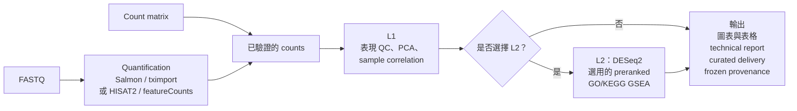

[English](README.md) | 繁體中文

# nf-rna

`nf-rna` 是可重現的 bulk RNA-seq workflow，支援 FASTQ 與 raw-count 專案。它會驗證已宣告的輸入與實驗設計，執行選定的 QC 與分析階段，並產生圖表、表格、technical report 與凍結的 provenance。

`rnaseq` 是 control plane，Nextflow 是 execution plane，Docker 是 process runtime。production 使用者透過 `rnaseq` 執行，不需要自行 build execution image 或呼叫內部 Nextflow module。

## 功能

- FASTQ 專案可使用 nf-core/rnaseq 的 Salmon/tximport，或 first-party HISAT2 + featureCounts。
- Raw-count 專案提供已驗證 metadata、明確 contrast、QC、differential expression 與選用的 preranked GSEA。
- Immutable run 會凍結設定、execution-image identity、workflow hash，並建立 curated delivery artifact。

## 架構

nf-rna 為兩種輸入路徑提供同一套經驗證、以 count 為基礎的下游分析流程。FASTQ 專案會先進行上游定量；count-matrix 專案則在驗證提供的 count 後進入下游路徑。兩條路徑會匯入相同的 expression analysis。



L1 提供表現品質控制與探索。L2 必須明確選擇：它會對已宣告的 contrast 執行 DESeq2，之後可進行支援的 preranked GO/KEGG GSEA；不會從 metadata 或 contrast 推測是否應執行 L2。每條路徑都會產生圖表、表格、technical report、curated delivery artifact 與 frozen provenance。

## 輸入與輸出

### 輸入

- **FASTQ：** 將 reads 放入 `input/fastq/`。FASTQ 專案會使用所選的 Salmon/tximport 或 HISAT2 + featureCounts route 進行 quantification，並需要與該 route 相容且 execution-ready 的 reference。
- **Count matrix：** 若 quantification 已在其他地方完成，且希望 nf-rna 執行已驗證的 downstream analysis，請將 imported gene-count matrix 放入 `input/counts.csv`。
- **Design 檔案：** `metadata.csv` 提供 sample ID 與 design variable；`contrasts.csv` 宣告 L2 使用的 directional contrast。
- **Reference：** FASTQ 專案明確宣告所選 reference route。reference identity 與 checksum 會在 run 中驗證並凍結，而不會從本機檔案推測。

### 輸出

每次授權執行都會在 `runs/<case-id>/<run-id>/` 建立 immutable run。run 會保留凍結的 inputs 與 configuration、execution-image 與 workflow identity，以及 provenance 和分析 artifact。

- **Upstream count data：** FASTQ 專案保留 upstream QC 與 Salmon/tximport 或 featureCounts 的 count handoff；count-matrix 專案保留已驗證的 imported count source。
- **L1 QC：** filtering 與 normalization 記錄、用於 visualization 的 transformed expression、PCA、sample correlation，以及 QC table 與 figure。
- **L2 結果：** 選擇 L2 時，針對每個已宣告 contrast 的 DESeq2 result，以及相關 table 與 figure。
- **Enrichment：** 在 L2 可獨立啟用 GO ORA、KEGG ORA 與 preranked GO（BP、MF、CC）/KEGG GSEA；ORA 使用每個 contrast 已成功 mapping 的 statistically tested-gene universe。
- **Delivery：** technical HTML report，以及包含 figure、table、methods/version record、provenance 與 delivery manifest 的 curated delivery package。

## 系統需求

請使用支援的 Linux 或 WSL workstation，並準備：

- Python 3.11+（含 `venv`）與 Git；
- 已啟動的 Docker daemon；
- 位於 `PATH` 的 Bash、Java 17+ 與 Nextflow；以及
- 足夠儲存 reference 與 Nextflow work data 的本機空間。

Java 與 Nextflow 在 host 執行。R、DESeq2、HISAT2、featureCounts、SAMtools 與 Salmon 由 execution image 提供，一般使用者不需要在 host 安裝。請參考 [Nextflow 官方文件](https://docs.seqera.io/nextflow/install)。

## 安裝

nf-rna 沒有 PyPI distribution。自 `v1.1.0` release 起，official image 會以
`ghcr.io/2002brian/nf-rna:X.Y.Z` 發布；請從 Git tag 安裝已發布的 CLI，並 pull
對應 image。將 `X.Y.Z` 換成想使用的已發布版本：

```bash
RELEASE_VERSION=X.Y.Z
python3.11 -m venv ~/.venvs/nf-rna-${RELEASE_VERSION}
source ~/.venvs/nf-rna-${RELEASE_VERSION}/bin/activate
python -m pip install --upgrade pip
python -m pip install "git+https://github.com/2002brian/nf-rna.git@v${RELEASE_VERSION}"
docker pull ghcr.io/2002brian/nf-rna:${RELEASE_VERSION}
rnaseq --version
rnaseq doctor
```

release contract 為：

```text
CLI X.Y.Z  ↔  Git tag vX.Y.Z  ↔  ghcr.io/2002brian/nf-rna:X.Y.Z
```

prerelease 只使用一種 canonical identity：Git tag 為 `vX.Y.Z-rcN`（或
`-aN`／`-bN`）、package version 為 `X.Y.ZrcN`（或 `aN`／`bN`），explicit
image tag 為 `X.Y.Z-rcN`。prerelease 絕不更新 `latest`；其他 prerelease tag
拼寫會被拒絕，以確保 immutable package 與 image identity 唯一。

發布前，workflow 會以 OCI Distribution API 檢查 immutable version tag。
只有結構化的 `404 MANIFEST_UNKNOWN`（tag 不存在）或 `404 NAME_UNKNOWN`
（首次發布、package 尚不存在）可以繼續；已存在的 manifest，以及
authentication／authorization、rate limit、network、server、malformed response
或其他不確定狀態一律 fail closed。version tag 一定先於 stable `latest` push。
同一 release tag 的 workflow concurrency 可避免一般重複執行，但外部 registry
仍可能在 check 與 push 間被變更；這是無法提供 registry-level atomicity 的殘餘
TOCTOU risk。

官方 GHCR 執行映像目前僅針對 `linux/amd64` 完成資格驗證。
`linux/arm64` 尚未經獨立驗證，不應視為正式支援的平台。

`v1.0.0` 是 immutable 的歷史 GitHub Release，早於 GHCR publication，
因此沒有 official container image。若需使用該歷史版本或進行開發，請自行
從 source build image。

`rnaseq doctor` 是 read-only 檢查；它會驗證 host 與本機 image，但不會 pull 或 build image。

## 快速開始

```bash
mkdir -p ~/projects/rnaseq-projects
cd ~/projects/rnaseq-projects
rnaseq new
cd <new-project>
# 將 FASTQ 放入 input/fastq/，或將 count matrix 放入 input/counts.csv。
# 完成 metadata.csv 與 contrasts.csv。
rnaseq validate .
rnaseq plan .
rnaseq doctor .
rnaseq run . --case-id CASE-001 --profile local --yes
```

wizard 只建立 project scaffold，不會推測科學輸入。FASTQ 專案還需要 execution-ready reference；可用 `rnaseq reference register /absolute/reference-root` 註冊既有的 checksum-bound managed reference，或設定支援的 reference route。詳細內容請見 [Quick Start](docs/quickstart.md)。

## 可重現性

新專案使用與已安裝 CLI 版本相符的 execution image。prerelease CLI 也使用明確相符的 prerelease tag；使用 prerelease 前必須先發布並驗證該 image。

正式分析應使用明確的 release tag 或 immutable digest。`ghcr.io/2002brian/nf-rna:latest` 只是 convenience tag，不應用於進行中的 production analysis。`rnaseq doctor PROJECT` 會報告 requested 與 Docker 實際觀察到的 image identity。

## 文件

- [Detailed Quick Start and v1.0.0 compatibility](docs/quickstart.md)
- [Runtime and reproducibility contract](docs/runtime.md)
- [Scientific contract](docs/scientific_contract.md)
- [Architecture](docs/architecture.md)

## 開發

git clone、editable install、local image build 與 tests 都是 contributor activity。請見 [Development installation](docs/development.md)。
