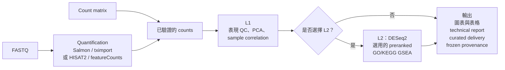

[English](README.md) | 繁體中文

# nf-rna

`nf-rna` 是可重現的 bulk RNA-seq workflow，支援 FASTQ 與 raw-count 專案。它會驗證已宣告的輸入與實驗設計，執行選定的 QC 與分析階段，並產生圖表、表格、technical report 與凍結的 provenance。

`rnaseq` 是 control plane，Nextflow 是 execution plane，所有 process 環境皆由 Conda 提供。v1.3.0 支援的 runtime 為 **Linux x86-64 或 Windows WSL2，搭配 Nextflow 與 Conda**，不需要 Docker。production 使用者透過 `rnaseq` 執行，不需要呼叫內部 Nextflow module。

## 功能

- FASTQ 專案可使用 nf-core/rnaseq 的 Salmon/tximport，或 first-party HISAT2 + featureCounts。
- Raw-count 專案提供已驗證 metadata、明確 contrast、QC、differential expression 與選用的 preranked GSEA。
- Immutable run 會凍結設定、精確的 nf-rna source commit、locked Conda runtime identity、workflow hash，並建立 curated delivery artifact。

## 架構

nf-rna 為兩種輸入路徑提供同一套經驗證、以 count 為基礎的下游分析流程。FASTQ 專案會先進行上游定量；count-matrix 專案則在驗證提供的 count 後進入下游路徑。兩條路徑會匯入相同的 expression analysis。



L1 提供表現品質控制與探索。L2 必須明確選擇：它會對已宣告的 contrast 執行 DESeq2，之後可進行支援的 preranked GO/KEGG GSEA；不會從 metadata 或 contrast 推測是否應執行 L2。每條路徑都會產生圖表、表格、technical report、curated delivery artifact 與 frozen provenance。

## 輸入與輸出

### 輸入

- **FASTQ：** 將 reads 放入 `input/fastq/`。FASTQ 專案會使用所選的 Salmon/tximport 或 HISAT2 + featureCounts route 進行 quantification，並需要與該 route 相容且 execution-ready 的 reference。
- **Count matrix：** 若 quantification 已在其他地方完成，且希望 nf-rna 執行已驗證的 downstream analysis，請將 imported gene-count matrix 放入 `input/counts.csv`。
- **Design 檔案：** `metadata.csv` 提供 sample ID 與 design variable；`contrasts.csv` 宣告 L2 使用的 directional contrast。
- **Reference：** FASTQ 專案明確宣告所選 reference route。reference identity 與 checksum 會在 run 中驗證並凍結，而不會從本機檔案推測。

### 輸出

每次授權執行都會在 `runs/<case-id>/<run-id>/` 建立 immutable run。run 會保留凍結的 inputs 與 configuration、nf-rna source commit、Conda runtime 與 workflow identity，以及 provenance 和分析 artifact。

- **Upstream count data：** FASTQ 專案保留 upstream QC 與 Salmon/tximport 或 featureCounts 的 count handoff；count-matrix 專案保留已驗證的 imported count source。
- **L1 QC：** filtering 與 normalization 記錄、用於 visualization 的 transformed expression、PCA、sample correlation，以及 QC table 與 figure。
- **L2 結果：** 選擇 L2 時，針對每個已宣告 contrast 的 DESeq2 result，以及相關 table 與 figure。
- **Enrichment：** 在 L2 可獨立啟用 GO ORA、KEGG ORA 與 preranked GO（BP、MF、CC）/KEGG GSEA；ORA 使用每個 contrast 已成功 mapping 的 statistically tested-gene universe。
- **Delivery：** technical HTML report，以及包含 figure、table、methods/version record、provenance 與 delivery manifest 的 curated delivery package。

## 系統需求

請使用 Linux x86-64 workstation，或 Windows 的 WSL2（v1.3.0 不支援 native Windows 與 macOS），並準備：

- Python 3.11+ 與 Git；
- 位於 `PATH` 的 Conda（例如 Miniforge），並依 nf-core 要求依序設定 `conda-forge` 與 `bioconda` channel（`conda config --add channels bioconda && conda config --add channels conda-forge && conda config --set channel_priority strict`）；
- 位於 `PATH` 的 Bash、Java 17+ 與 Nextflow；以及
- 足夠儲存 reference、Conda environment 與 Nextflow work data 的本機空間。

不需要 Docker。Java、Nextflow 與 Conda 在 host 執行。nf-core/rnaseq 3.26.0 以 `-profile conda` 執行；HISAT2/featureCounts 使用精確 pin 的 Conda environment；R、DESeq2、tximport 與 enrichment 套件在 nf-rna 首次使用時建立的 locked linux-64 Conda environment 中執行。一般使用者不需要手動安裝這些工具。請參考 [Nextflow 官方文件](https://docs.seqera.io/nextflow/install)。

## 安裝

nf-rna 沒有 PyPI distribution。請從 Git tag 安裝已發布的 CLI。從 Git 安裝時，
pip 會記錄精確的 source commit，而每次 run 都必須記錄它；若安裝方式沒有 commit
（例如直接安裝目錄、sdist 或 wheel），nf-rna 會拒絕執行。將 `X.Y.Z` 換成想使用的
已發布版本：

```bash
RELEASE_VERSION=X.Y.Z
conda create --yes --name nf-rna python=3.11
conda activate nf-rna
python -m pip install --upgrade pip
python -m pip install "git+https://github.com/2002brian/nf-rna.git@v${RELEASE_VERSION}"
rnaseq --version
rnaseq doctor
```

首次執行時，nf-rna 會在 runtime cache 建立 locked downstream Conda environment
（每個 lock 與已安裝 nf-rna build 各一個），之後的 run 會重複使用。nf-core/rnaseq
與 HISAT2/featureCounts 的 process environment 由 Nextflow 建立於共用的 upstream
Conda cache。

release contract 為：

```text
CLI X.Y.Z  ↔  Git tag vX.Y.Z  ↔  單一 source commit（記錄於每次 run）
```

`rnaseq doctor` 是 read-only 檢查；它會檢查 Java、Nextflow、Conda 與其 channel 設定、
nf-core/rnaseq pin、downstream Conda lock 與 nf-rna source revision，最後輸出
`Overall: READY` 或 `Overall: NOT READY`（exit code 1）。它不會建立 environment 或下載
pipeline。

### 歷史 Docker release

`v1.1.2` 至 `v1.2.1` 的 process 在 Docker 中執行，並以
`ghcr.io/2002brian/nf-rna:X.Y.Z` 發布 official image（僅針對 `linux/amd64` 完成
資格驗證）。`v1.2.1` 是最後一個以 Docker 為基礎的 release；v1.3.0 不需要也不驗證
Docker image。`v1.0.0` 早於 GHCR publication；`v1.1.0`/`v1.1.1` 仍是有效的 source
release，但 publication workflow 在 image build 或 push 前停止，因此沒有 official image。

## 快速開始

```bash
mkdir -p ~/projects/rnaseq-projects
cd ~/projects/rnaseq-projects
rnaseq new
cd <new-project>
# 將 FASTQ 放入 input/fastq/，或將 count matrix 放入 input/counts.csv。
# 完成 metadata.csv 與 contrasts.csv。
rnaseq validate .
rnaseq plan .
rnaseq doctor .
rnaseq run . --case-id CASE-001 --profile local --yes
```

wizard 只建立 project scaffold，不會推測科學輸入。FASTQ 專案還需要 execution-ready reference；可用 `rnaseq reference register /absolute/reference-root` 註冊既有的 checksum-bound managed reference，或設定支援的 reference route。詳細內容請見 [Quick Start](docs/quickstart.md)。

## 支援 covariate 的 DESeq2 design

新的 schema 1.3 專案會明確宣告每個 additive formula variable 的型別。`categorical` 在 R 中會成為 factor；`continuous` 則是必須為有限數值的調整 covariate。既有 schema 1.0–1.2 專案仍可讀取，並保留原本的 categorical／明確數值行為。

```yaml
design:
  type: multi_group
  formula: "~ batch + age + condition"
  variables:
    batch: categorical
    age: continuous
    condition: categorical
```

支援的 additive 範例包括 `~ condition`、`~ age + condition`、`~ batch + condition` 與 `~ batch + age + condition`。contrast 仍是 categorical 且有方向性，例如 `Treatment_vs_Control,condition,Treatment,Control`；continuous variable 只會調整估計值，不能作為 numerator/denominator contrast。

使用 `rnaseq new` 匯入 metadata 時，categorical adjustment 用 `--covariate batch`，numeric adjustment 用 `--continuous-covariate age`；wizard 對每個選取的 covariate 也會詢問相同的型別。

已知的 batch effect 應放入 DESeq2 design（`~ batch + condition`），而不是先修改 raw count matrix。nf-rna 會保留原始 counts 進行 inferential analysis、在 provenance 和 report 記錄 typed design，並在 VST exploratory QC 提供 batch metadata（若 `batch` 宣告為 categorical，另輸出 batch-colored PCA）。continuous effect 的 hypothesis test 不屬於本 milestone。

## 可重現性

每次 run 都會記錄 nf-rna source commit、downstream Conda lock 與其 SHA-256、已安裝 nf-rna wheel 的 SHA-256、bundled R-script inventory、nf-core/rnaseq version 與 revision，以及 reference manifest 與檔案 checksum。若 source commit 未知，或 source checkout 有未 commit 的變更，nf-rna 會拒絕開始 run。

正式分析應安裝明確的 release tag。`rnaseq doctor PROJECT` 會在執行前報告 source revision、Conda lock 與已建立的 runtime。

## 文件

- [Detailed Quick Start and v1.0.0 compatibility](docs/quickstart.md)
- [Runtime and reproducibility contract](docs/runtime.md)
- [Scientific contract](docs/scientific_contract.md)
- [Architecture](docs/architecture.md)

## 開發

git clone、editable install 與 tests 都是 contributor activity。請見 [Development installation](docs/development.md)。
